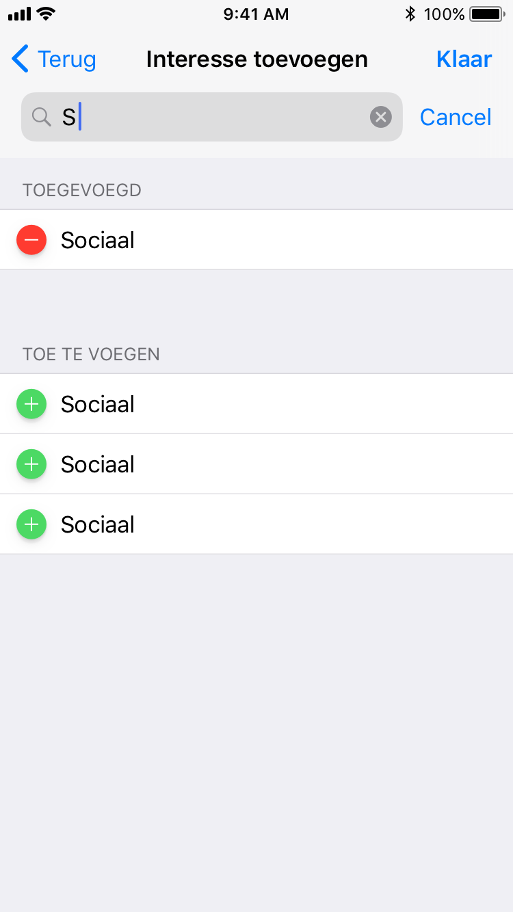

# Beschrijving van de PoC's

Geef een beschrijving van de test die je gedaan hebt met elk Proof of Concept. Voeg 
 de code ook toe in de map **code**.
 
### Android StepCounter

* **hypothese:**  
Er kwam vanuit de groep een vraag naar een lijst zoals bijvoorbeeld bij de contacten app met de plusjes en minnetjes, zie onderstaand voorbeeld van ons concept. 

Ik zag hier wat meer uitdaging in om dit lekker vloeiend te laten werken. 

* **testopzet:**  
Ik heb een voorbeeld gezocht voor een simpele lijst waarin gezocht kon worden, in dit geval met snoepgoed ;) 
Deze heb ik aangepast zodat ik snoepgoed kon toevoegen en verwijderen. 

* **resultaat:**  
Om dit te realiseren heb ik een ios applicatie gemaakt dat bovenstaande implementeerd. Zie voorbeeld hieronder:

De complexere punten waren:
- Het zoekmechanisme.
- De plus en min knoppen. (heb ik op dezelfde manier gedaan als in mattias z'n poc) 
- Het bijhouden en tonen van de twee lijsten in de sectoren. 

1. Ik heb voor het zoeken eerst [deze tutorial](https://www.raywenderlich.com/157864/uisearchcontroller-tutorial-getting-started) doorgelopen, tot ik genoeg had om in mijn lijstje van snoepgoed te kunnen zoeken. 
2. Ik had twee sectoren gemaakt in de tableview die zodat ik ook de verschillende knoppen kon tonen (met een simpele switch en nog dezelfde lijst)
3. Ik heb twee extra lijsten gemaakt waar ik in bijhoud wat er in de toegevoegde en nog toe te voegen lijsten zit. 
4. Aanpassingen gemaakt aan zoek mechanisme zodat ik in twee lijsten tegelijk kan zoeken. 
